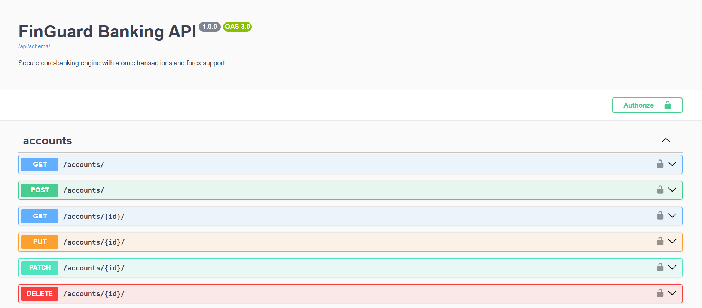
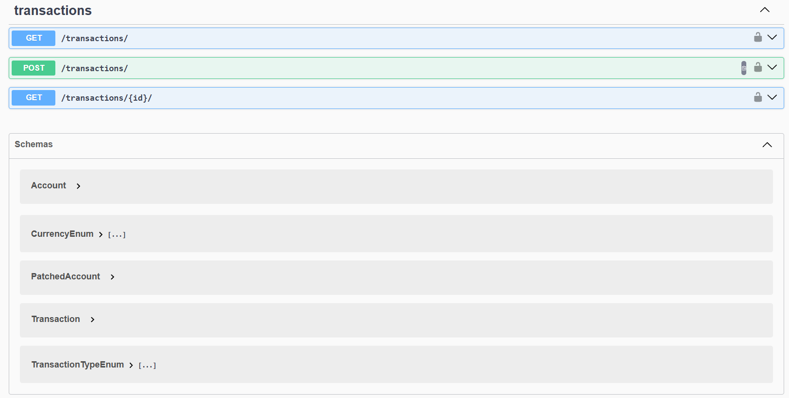

# FinGuard Banking API
A secure, high-precision core-banking engine built with **Django REST Framework**.

## Features
* **Atomic Transactions:** Prevents data corruption during transfers using database-level row locking (`select_for_update`).
* **Multi-Currency Support:** Automatic currency conversion between USD, EUR, and GBP with high-precision `Decimal` math.
* **Security First:** Strict ownership enforcement—users can only transact from accounts they own.
* **Audit Trail:** Immutable transaction logs (no editing or deleting history).
* **Auto-Documentation:** Fully documented with OpenAPI 3.0 and Swagger UI.

## Tech Stack
* **Backend:** Python, Django, Django REST Framework
* **Database:** PostgreSQL (recommended) / SQLite
* **Documentation:** drf-spectacular (Swagger UI)

## API Documentation

*Interactive documentation available at `/api/docs/` when running locally.*

